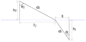
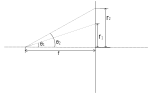

Optical Deduction
=================

# The Law of the Refraction

As the graph shows, the speed ratio between the two media is $\alpha$.

The parameters satisfy the following equations:
$d_1=\sqrt{h_1^2+l_1^2}$, $d_2=\sqrt{h_2^2+l_2^2}=\sqrt{h_2^2+(L-l_1)^2}$,
$\begin{aligned}\sin\theta_1=\frac{l_1}{d_1}\end{aligned}$, $\begin{aligned}\sin\theta_2=\frac{l_2}{d_2}=\frac{L-l_1}{d_2}\end{aligned}$.

So we can get the following equations:

$$\begin{aligned}\frac{\partial d_1}{\partial l_1}=\frac{l_1}{\sqrt{h_1^2+l_1^2}}=\frac{l_1}{d_1}=\sin\theta_1\end{aligned}$$

$$\begin{aligned}\frac{\partial d_2}{\partial l_1}=\frac{l_1-L}{\sqrt{h_1^2+(L-l_1)^2}}=\frac{l_2}{d_2}=-\sin\theta_2\end{aligned}$$

The time which the light travels from source to the destination costs is:
$$\begin{aligned}t=\frac{d_2}{c}+\frac{\alpha d_1}{c}\end{aligned}$$

The partial derivative of the time is:
$$\begin{aligned}\frac{\partial t}{\partial l_1}&=\frac{\partial d_2}{c\partial l_1}+\frac{\alpha \partial d_1}{c\partial l_1}\\
&=\frac{1}{c}(\sin\theta_2-\alpha\sin\theta_1)\end{aligned}$$

When $\begin{aligned}\frac{\partial t}{\partial l_1}=0\end{aligned}$, $t$ takes the extremum and $\begin{aligned}\frac{\sin\theta_2}{\sin\theta_1}=\alpha\end{aligned}$.
As the $\begin{aligned}\frac{\partial t}{\partial l_1}\end{aligned}$ is less than $0$ when $l_1$ is smaller than the zero point, and
$\begin{aligned}\frac{\partial t}{\partial l_1}\end{aligned}$ is larger than $0$ when $l_1$ is greater than the zero point, the extremum $t$ takes is the minimum.

# Lens Equations

$\begin{aligned}\frac{1}{f}=(\alpha-1)\left(\frac{1}{r_1}-\frac{1}{r_2}\right)\end{aligned}$

$\begin{aligned}\frac{1}{f}=(\alpha-1)\left[\frac{1}{r_1}-\frac{1}{r_2}+\frac{d(\alpha-1)}{\alpha r_1 r_2}\right]\end{aligned}$

$\begin{aligned}\frac{1}{f}=\frac{1}{u}+\frac{1}{v}\end{aligned}$

# Ideal Lens

$\begin{aligned}\frac{r_1}{\tan\theta_1}=\frac{r_2}{\tan\theta_2}=f\end{aligned}$

$\begin{aligned}\tan\theta=\frac{r}{f}\end{aligned}$

# Fresnel Lens

$\begin{aligned}\alpha=\frac{\sin(\theta+x)}{\sin x}=\sin\theta\cot x+\cos\theta\end{aligned}$

$\begin{aligned}\cot x=\frac{\alpha}{\sin\theta}-\cot\theta\end{aligned}$

$\begin{aligned}F'(r)=\frac{r}{f-\alpha\sqrt{r^2+f^2}}\end{aligned}$

>  $\begin{aligned}\frac{1}{F'(r)}=\frac{\alpha}{r}\sqrt{f^2+r^2}-\frac{f}{r}\end{aligned}$

$\begin{aligned}F(r)=-\frac{f}{\alpha^2}\ln(\alpha\sqrt{r^2+f^2}-f)-\frac{\sqrt{r^2+f^2}}{\alpha}+C\end{aligned}$

>  $\begin{aligned}F(r)=-\alpha f\arcsinh\frac{f}{r}-f\ln r+\alpha\sqrt{r^2+f^2} \end{aligned}$

$\begin{aligned}F(r)=\frac{f}{2} \ln\left[1 - \frac{2f}{f+\sqrt{r^2+f^2}}\right]+\sqrt{r^2+f^2}+C \end{aligned}$

# Continuous Surface Lens

$\begin{aligned}\tan\theta=\frac{r}{F(r)+f}\end{aligned}$

# Ideal Focusing Lens
$\begin{aligned}\frac{F'(r)r}{f-F(r)}+1=\alpha\sqrt{\frac{r^2}{[f-F(r)]^2}+1}\end{aligned}$

