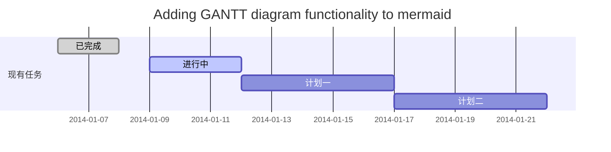
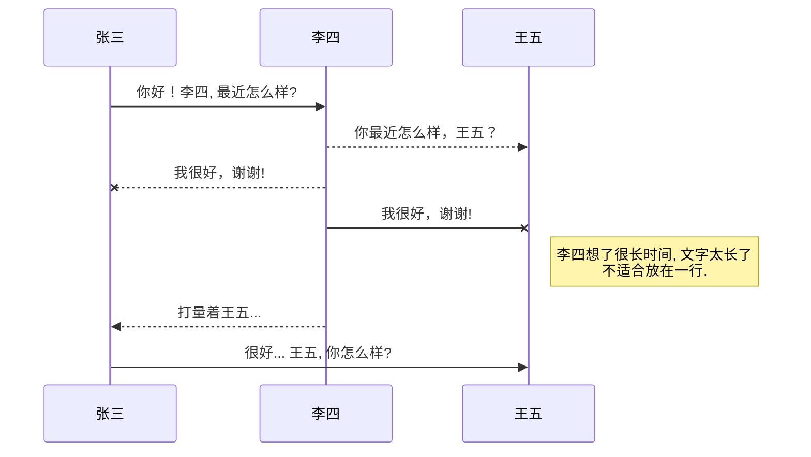
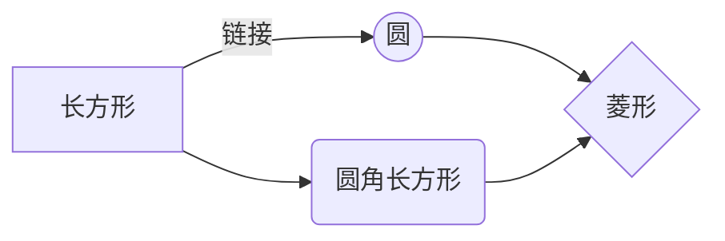
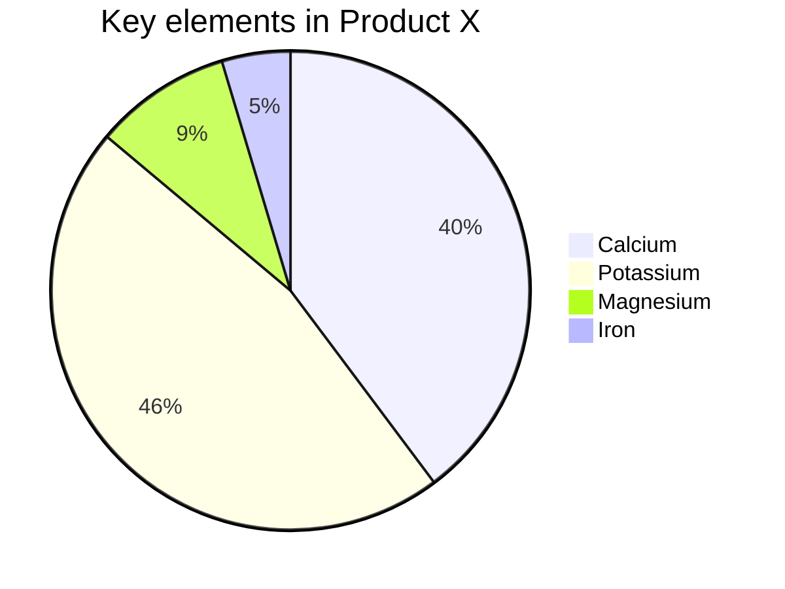
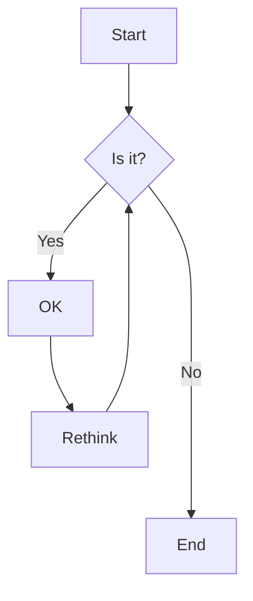

```mermaid
gantt
    dateFormat  YYYY-MM-DD
    title Adding GANTT diagram functionality to mermaid
    section 现有任务
    已完成               :done,    des1, 2014-01-06,2014-01-08
    进行中               :active,  des2, 2014-01-09, 3d
    计划一               :         des3, after des2, 5d
    计划二               :         des4, after des3, 5d

```

```mermaid
sequenceDiagram
张三 ->> 李四: 你好！李四, 最近怎么样?
李四-->>王五: 你最近怎么样，王五？
李四--x 张三: 我很好，谢谢!
李四-x 王五: 我很好，谢谢!
Note right of 王五: 李四想了很长时间, 文字太长了<br/>不适合放在一行.

李四-->>张三: 打量着王五...
张三->>王五: 很好... 王五, 你怎么样?
```

```mermaid
graph LR
A[长方形] -- 链接 --> B((圆))
A --> C(圆角长方形)
B --> D{菱形}
C --> D
```

```mermaid
pie
    title Key elements in Product X
    "Calcium" : 42.96
    "Potassium" : 50.05
    "Magnesium" : 10.01
    "Iron" :  5
```

```mermaid
flowchart
    A[Start] --> B{Is it?};
    B -- Yes --> C[OK];
    C --> D[Rethink];
    D --> B;
    B -- No ----> E[End];
```
