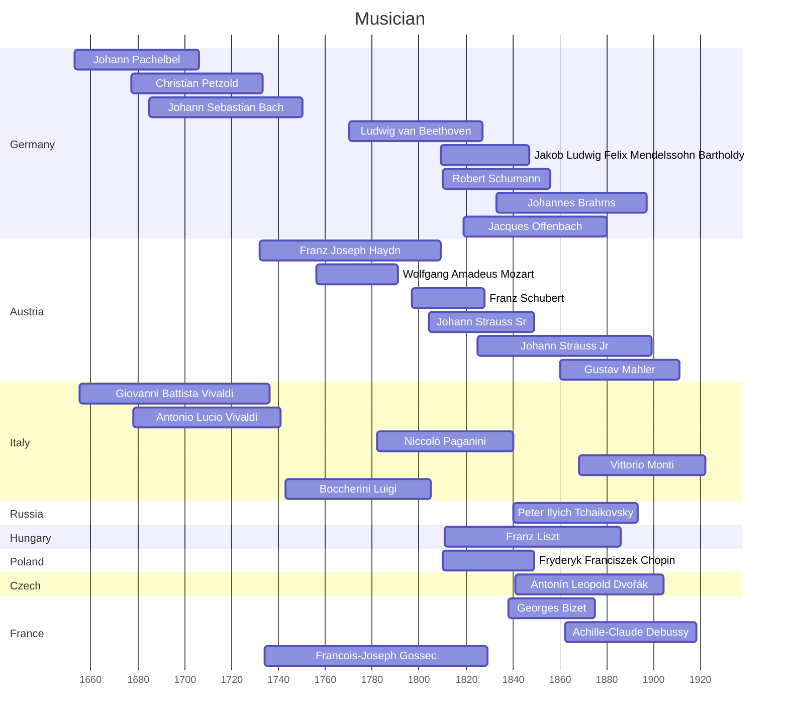

Musician
=======

Romantic

baroque一词的起源，公认的看法是源出葡萄牙语barroco(西班牙语也为barroco)一词，意为“不合常规”，特指各种外形有瑕疵的珍珠。

| 曲名 | 外文名 | 国家 | 作曲家 | 外文名 |
|--------|-----------------|-------|-----------------|--------------------|
|小步舞曲|Minuet in G Major|【德】|路德维希·凡·贝多芬|Ludwig van Beethoven|
|小步舞曲|Minuet in G Major|【德】|约翰·塞巴斯蒂安·巴赫|Johann Sebastian Bach|
|小步舞曲|Minuet in E Minor|【意】|路易吉·博凯里尼|Luigi Boccherini|
|小步舞曲|Minuet in D Minor|【奥】|沃尔夫冈·阿玛多伊斯·莫扎特|Wolfgang Amadeus Mozart|
|f小调音乐瞬间|Moment Musical in F Minor|【奥】|弗朗茨·舒伯特|Franz Schubert|
|C大调幻想曲|Fantasia in C Major|【德】|罗伯特·舒曼|Robert Schumann|
|G弦上的咏叹调-圣母颂|Aria on G String-Ave Maria|【德】|约翰·塞巴斯蒂安·巴赫|Johann Sebastian Bach|
|土耳其进行曲|Turkey March|【奥】|沃尔夫冈·阿玛多伊斯·莫扎特|Wolfgang Amadeus Mozart|
|悲怆奏鸣曲|8th Piano Sonata - Pathetique |【德】|路德维希·凡·贝多芬|Ludwig van Beethoven|
|小夜曲|Piano Serenade No.20 in E Flat Major|【波】|弗里德里克·弗朗索瓦·肖邦|Fryderyk Franciszek Chopin|
|加伏特舞曲|Gavotte en Rondeau|【法】|弗朗索瓦·约瑟夫·戈塞克|François Joseph Gossec|
|g小调第40号交响曲|Symphony No.40 in G Minor|【奥】|沃尔夫冈·阿玛多伊斯·莫扎特|Wolfgang Amadeus Mozart|
|降G大调幽默曲|Humoresque in G Flat Major|【捷】|安东·利奥波德·德沃夏克|Antonín Leopold Dvořák|
|天鹅湖|Лебединое озеро танец|【俄】|彼得·伊里奇·柴可夫斯基|Пётр Ильич Чайковский|
|卡农|Khanom in D Major|【德】|约翰·帕赫贝尔|Johann Pachelbel|
|月光曲|Piano Sonata No.14 in C Sharp Minor|【德】|路德维希·凡·贝多芬|Ludwig van Beethoven|
|月光曲|Clair de Lune|【法】|阿希尔-克洛德·德彪西|Achille-Claude Debussy|
|e小调小提琴协奏曲|Violin Concerto in e Minor|【德】|雅科布·路德维希·费利克斯·门德尔松·巴托尔迪|Jakob Ludwig Felix Mendelssohn Bartholdy|
|蓝色多瑙河圆舞曲|An der schönen blauen Donau-Walzer,op.314|【奥】|小约翰·施特劳斯|Johann Strauß|
|拉德斯基交响曲|Padetzky-marsch Symphony |【奥】|老约翰·施特劳斯|Johann Strauß|
|c小调第五交响曲-命运|Symphony No. 5 in C Minor - Fate|【德】|路德维希·凡·贝多芬|Ludwig van Beethoven|
|F大调第六交响曲-田园|Symphony No. 6 in F Major - Pastoral |【德】|路德维希·凡·贝多芬|Ludwig van Beethoven|
|致爱丽丝|Bagatelle No. 25 in A Minor for Solo Piano- Für Elise|【德】|路德维希·凡·贝多芬|Ludwig van Beethoven|
|查尔达什舞曲|Csárdás 【d→D】|【意】|维托里奥·蒙蒂|Vittorio Monti|
|匈牙利舞曲No.5|Hungarian Dance Brahms No.5|【德】|约翰内斯·勃拉姆斯|Johannes Brahms|
|自新大陆-第九交响曲(第四乐章)|Symphony No.9 in e Minor - From The New World |【捷】|安东·利奥波德·德沃夏克|Antonín Leopold Dvořák|
|春-四季|Le quattro stagioni - E Major|【意】|安东尼奥·维瓦尔第|Antonio Lucio Vivaldi|
|夏-四季|Le quattro stagioni - g Minor|【意】|安东尼奥·维瓦尔第|Antonio Lucio Vivaldi|
|秋-四季|Le quattro stagioni - F Major|【意】|安东尼奥·维瓦尔第|Antonio Lucio Vivaldi|
|冬-四季|Le quattro stagioni - f Minor|【意】|安东尼奥·维瓦尔第|Antonio Lucio Vivaldi|
|雷鸣电闪波尔卡|Unter Donner und Blitz|【奥】|小约翰·施特劳斯|Johann Strauss Jr|

## 电影配乐

### 日本
|          |      |       |              |               |
|----------|------|-------|--------------|---------------|
|遥远的旅途|      |       | 吉田洁              |               |
|英雄的黎明|      |       | 横山菁儿             |               |
|故乡的原风景|      |       | 宗次郎              |               |
|万里长城|      |       | 太田美知彦             |               |
|故宫的回忆|      |       | 神思者             | S.E.N.S               |
|太阳照常升起|    |       | 久石让            ||
